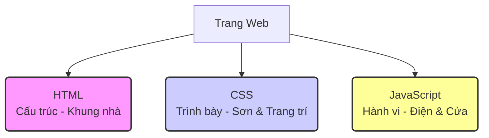
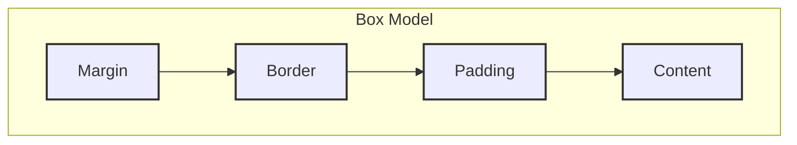

# Giới thiệu về HTML, CSS và JavaScript: Bộ ba nền tảng của Web

Chào mừng bạn đến với thế giới phát triển web! Nếu bạn đang tò mò về cách các trang web đẹp mắt và tương tác mà bạn truy cập hàng ngày được tạo ra, thì bạn đã đến đúng nơi. Hành trình này sẽ dẫn dắt bạn qua ba công nghệ cốt lõi tạo nên hầu hết mọi trải nghiệm trên web: HTML, CSS và JavaScript.

Hãy tưởng tượng việc xây dựng một ngôi nhà. Bạn cần một bộ khung vững chắc để định hình cấu trúc (đó là **HTML**), sau đó bạn sơn tường, trang trí nội thất để ngôi nhà trông đẹp mắt (đó là **CSS**), và cuối cùng, bạn lắp đặt hệ thống điện, nước, cửa tự động để ngôi nhà có thể hoạt động và tương tác (đó là **JavaScript**).

**Sơ đồ minh họa (Ẩn dụ Ngôi nhà):**



Trong bài hướng dẫn này, chúng ta sẽ cùng nhau khám phá:

*   **HTML (HyperText Markup Language):** Ngôn ngữ đánh dấu siêu văn bản, dùng để xây dựng cấu trúc và nội dung cơ bản của trang web. Giống như bộ xương của cơ thể, HTML định hình các thành phần như tiêu đề, đoạn văn, hình ảnh, liên kết, v.v.
*   **CSS (Cascading Style Sheets):** Ngôn ngữ tạo kiểu, dùng để kiểm soát giao diện và cách trình bày của các thành phần HTML. CSS giúp trang web của bạn trở nên hấp dẫn hơn với màu sắc, phông chữ, bố cục và hiệu ứng hình ảnh.
*   **JavaScript:** Ngôn ngữ lập trình mạnh mẽ, dùng để tạo ra sự tương tác và các tính năng động cho trang web. Từ các hiệu ứng đơn giản, kiểm tra dữ liệu người dùng nhập vào biểu mẫu, đến các ứng dụng web phức tạp, JavaScript làm cho trang web trở nên sống động và hữu ích.

Mục tiêu của tài liệu này là giúp bạn, ngay cả khi là người mới bắt đầu, có thể hiểu rõ vai trò của từng công nghệ và quan trọng hơn là cách chúng phối hợp nhịp nhàng với nhau để tạo nên một trang web hoàn chỉnh. Chúng ta sẽ đi từ những khái niệm cơ bản nhất, kèm theo các ví dụ minh họa và sơ đồ trực quan để bạn dễ dàng hình dung và nắm bắt kiến thức.

Nào, hãy cùng bắt đầu hành trình khám phá bộ ba quyền lực này!


## Phần 1: HTML - Nền móng của trang web

Như đã đề cập trong phần giới thiệu, HTML (HyperText Markup Language) chính là bộ khung xương, là nền tảng cấu trúc cho mọi trang web. Nó không phải là một ngôn ngữ lập trình thực thụ (không có logic, vòng lặp, hay điều kiện), mà là một **ngôn ngữ đánh dấu**. Nhiệm vụ của HTML là "đánh dấu" các phần khác nhau của nội dung để trình duyệt web hiểu và hiển thị chúng một cách chính xác.

### 1.1. Cấu trúc cơ bản của một tài liệu HTML

Mọi tài liệu HTML đều tuân theo một cấu trúc cơ bản. Hãy xem ví dụ đơn giản sau:

```html
<!DOCTYPE html>
<html>
<head>
    <meta charset="UTF-8">
    <meta name="viewport" content="width=device-width, initial-scale=1.0">
    <title>Tiêu đề trang web</title>
</head>
<body>
    <h1>Đây là một tiêu đề chính</h1>
    <p>Đây là một đoạn văn bản.</p>
    
    <a href="https://www.example.com">Đây là một liên kết</a>
</body>
</html>
```

**Giải thích các thành phần:**

*   `<!DOCTYPE html>`: Khai báo loại tài liệu, cho trình duyệt biết đây là tài liệu HTML5 (phiên bản HTML mới nhất).
*   `<html>`: Thẻ gốc, bao bọc toàn bộ nội dung của trang web.
*   `<head>`: Chứa các thông tin meta về trang web (không hiển thị trực tiếp trên nội dung chính), ví dụ:
    *   `<meta charset="UTF-8">`: Khai báo bộ mã ký tự sử dụng (UTF-8 hỗ trợ tiếng Việt).
    *   `<meta name="viewport" ...>`: Cấu hình cách trang web hiển thị trên các thiết bị khác nhau (quan trọng cho responsive design).
    *   `<title>`: Tiêu đề của trang web, hiển thị trên tab của trình duyệt.
*   `<body>`: Chứa toàn bộ nội dung sẽ được hiển thị trên trang web, bao gồm văn bản, hình ảnh, liên kết, video, v.v.

### 1.2. Thẻ (Tags) HTML: Viên gạch xây dựng nội dung

HTML sử dụng các **thẻ** (tags) để định nghĩa các phần tử khác nhau. Hầu hết các thẻ đều đi theo cặp: thẻ mở (`<tagname>`) và thẻ đóng (`</tagname>`). Nội dung nằm giữa cặp thẻ này.

Một số thẻ cơ bản và thường dùng:

*   `<h1>` đến `<h6>`: Định nghĩa các cấp tiêu đề (heading), `<h1>` là cấp cao nhất.
*   `<p>`: Định nghĩa một đoạn văn bản (paragraph).
*   `<a>`: Định nghĩa một liên kết (anchor). Thuộc tính `href` chỉ định URL đích.
*   ``: Nhúng một hình ảnh (image). Thuộc tính `src` chỉ định đường dẫn đến file ảnh, `alt` cung cấp mô tả thay thế cho ảnh.
*   `<div>`: Định nghĩa một khối (division) hoặc một vùng chứa chung, thường dùng để nhóm các phần tử khác lại cho mục đích tạo kiểu hoặc xử lý bằng JavaScript.
*   `<span>`: Định nghĩa một phần nhỏ trong dòng (inline), thường dùng để áp dụng kiểu hoặc xử lý cho một phần văn bản nhỏ.
*   `<ul>`, `<ol>`, `<li>`: Tạo danh sách không có thứ tự (`<ul>` - unordered list) hoặc có thứ tự (`<ol>` - ordered list), với mỗi mục danh sách là `<li>` (list item).
*   `<button>`: Tạo một nút bấm.
*   `<input>`: Tạo các trường nhập liệu trong biểu mẫu (form).

### 1.3. Mô hình Đối tượng Tài liệu (DOM - Document Object Model)

Khi trình duyệt tải một trang HTML, nó không chỉ đọc văn bản mà còn xây dựng một cấu trúc dữ liệu dạng cây gọi là **DOM**. DOM biểu diễn tài liệu HTML như một tập hợp các đối tượng (nodes) có mối quan hệ cha-con. Mỗi thẻ HTML, mỗi đoạn văn bản, mỗi thuộc tính đều trở thành một node trong cây DOM.

Ví dụ, với đoạn HTML trên, cây DOM có thể hình dung đơn giản như sau:

```
HTML
├── HEAD
│   ├── META (charset)
│   ├── META (viewport)
│   └── TITLE
│       └── "Tiêu đề trang web"
└── BODY
    ├── H1
    │   └── "Đây là một tiêu đề chính"
    ├── P
    │   └── "Đây là một đoạn văn bản."
    ├── IMG (src, alt)
    └── A (href)
        └── "Đây là một liên kết"
```

**Tại sao DOM quan trọng?**

DOM chính là cầu nối để CSS và đặc biệt là JavaScript có thể tương tác và thay đổi nội dung, cấu trúc, và kiểu dáng của trang web một cách linh hoạt sau khi trang đã được tải. Chúng ta sẽ tìm hiểu kỹ hơn về vai trò của DOM khi nói về CSS và JavaScript.

Phần tiếp theo, chúng ta sẽ khám phá CSS - công cụ giúp "trang điểm" cho cấu trúc HTML này.


## Phần 2: CSS - Khoác áo cho trang web

Nếu HTML tạo nên cấu trúc, thì CSS (Cascading Style Sheets) chính là nghệ sĩ trang điểm, mang lại vẻ đẹp và phong cách cho cấu trúc đó. CSS cho phép bạn kiểm soát mọi khía cạnh về giao diện của trang web, từ màu sắc, phông chữ, kích thước cho đến bố cục và thậm chí cả các hiệu ứng hoạt hình đơn giản.

### 2.1. Tại sao cần CSS?

Thử tưởng tượng một trang web chỉ có HTML thuần túy - nó sẽ trông giống như một tài liệu văn bản đơn điệu. CSS giúp chúng ta:

*   **Tách biệt nội dung và trình bày:** HTML tập trung vào ý nghĩa (semantic) của nội dung, còn CSS lo phần hình thức. Điều này giúp mã nguồn sạch sẽ, dễ bảo trì hơn.
*   **Tái sử dụng kiểu dáng:** Bạn có thể định nghĩa một kiểu (ví dụ: màu chữ xanh, in đậm) và áp dụng nó cho nhiều phần tử HTML khác nhau mà không cần lặp lại mã.
*   **Kiểm soát bố cục:** Sắp xếp các phần tử trên trang, tạo cột, định vị chính xác các thành phần.
*   **Responsive Design:** Giúp trang web hiển thị tốt trên nhiều kích thước màn hình khác nhau (máy tính, máy tính bảng, điện thoại).

### 2.2. Cách thêm CSS vào HTML

Có ba cách chính để áp dụng CSS cho các phần tử HTML:

1.  **Inline CSS (CSS nội tuyến):** Sử dụng thuộc tính `style` trực tiếp trong thẻ HTML. Cách này ít được khuyến khích vì làm lẫn lộn cấu trúc và trình bày, khó bảo trì.
    ```html
    <p style="color: blue; font-size: 16px;">Đoạn văn bản này màu xanh và cỡ chữ 16px.</p>
    ```
2.  **Internal CSS (CSS nội bộ):** Đặt các quy tắc CSS bên trong thẻ `<style>` trong phần `<head>` của tài liệu HTML. Phù hợp cho các trang đơn lẻ hoặc khi cần áp dụng kiểu riêng cho một trang.
    ```html
    <head>
        <title>Trang có CSS nội bộ</title>
        <style>
            p {
                color: green;
                text-align: center;
            }
            h1 {
                color: navy;
            }
        </style>
    </head>
    <body>
        <h1>Tiêu đề</h1>
        <p>Đoạn văn này sẽ có màu xanh lá và căn giữa.</p>
    </body>
    ```
3.  **External CSS (CSS ngoại tuyến):** Viết các quy tắc CSS vào một file riêng biệt (đuôi `.css`) và liên kết nó với tài liệu HTML bằng thẻ `<link>` trong phần `<head>`. Đây là cách **tốt nhất và được khuyến khích nhất** vì nó tách biệt hoàn toàn CSS khỏi HTML, dễ quản lý, tái sử dụng và cho phép trình duyệt lưu cache file CSS, tăng tốc độ tải trang.
    *   **File `styles.css`:**
        ```css
        body {
            font-family: sans-serif;
        }
        p {
            color: purple;
            line-height: 1.6;
        }
        .highlight {
            background-color: yellow;
            font-weight: bold;
        }
        #main-title {
            border-bottom: 2px solid orange;
        }
        ```
    *   **File `index.html`:**
        ```html
        <head>
            <title>Trang sử dụng CSS ngoại tuyến</title>
            <link rel="stylesheet" href="styles.css">
        </head>
        <body>
            <h1 id="main-title">Tiêu đề chính</h1>
            <p>Đây là đoạn văn bình thường.</p>
            <p class="highlight">Đoạn văn này được làm nổi bật.</p>
        </body>
        ```

### 2.3. Bộ chọn (Selectors) CSS: Nhắm mục tiêu phần tử HTML

Để áp dụng kiểu cho một phần tử HTML cụ thể, bạn cần sử dụng **bộ chọn (selector)**. Selector chỉ định phần tử nào sẽ nhận các quy tắc CSS đi kèm.

Một số selector cơ bản:

*   **Selector phần tử (Element Selector):** Chọn tất cả các phần tử có tên thẻ tương ứng.
    ```css
    p { /* Áp dụng cho tất cả thẻ <p> */
        color: gray;
    }
    ```
*   **Selector lớp (Class Selector):** Chọn tất cả các phần tử có thuộc tính `class` khớp với tên lớp (bắt đầu bằng dấu `.`). Một phần tử có thể có nhiều lớp.
    ```css
    .important { /* Áp dụng cho tất cả phần tử có class="important" */
        font-weight: bold;
    }
    ```
*   **Selector ID (ID Selector):** Chọn một phần tử duy nhất có thuộc tính `id` khớp với tên ID (bắt đầu bằng dấu `#`). ID phải là duy nhất trong toàn bộ tài liệu HTML.
    ```css
    #logo { /* Áp dụng cho phần tử có id="logo" */
        width: 100px;
    }
    ```
*   **Selector thuộc tính (Attribute Selector):** Chọn các phần tử dựa trên sự tồn tại hoặc giá trị của một thuộc tính.
    ```css
    a[target="_blank"] { /* Chọn thẻ <a> có thuộc tính target="_blank" */
        color: red;
    }
    ```
*   **Selector kết hợp:** Bạn có thể kết hợp các selector để tạo ra các quy tắc phức tạp hơn (ví dụ: `div p` chọn tất cả thẻ `<p>` nằm bên trong thẻ `<div>`).

### 2.4. Mô hình Hộp (Box Model): Hiểu về không gian của phần tử

Mọi phần tử HTML trên trang web đều có thể được coi là một chiếc hộp chữ nhật. Mô hình hộp CSS mô tả cách không gian được phân bổ xung quanh phần tử này. Nó bao gồm bốn lớp từ trong ra ngoài:

1.  **Content:** Nội dung thực tế của phần tử (văn bản, hình ảnh, v.v.). Kích thước của nó được xác định bởi `width` và `height`.
2.  **Padding:** Khoảng đệm trong suốt giữa nội dung và đường viền. Nó tạo không gian bên trong hộp.
3.  **Border:** Đường viền bao quanh padding và content. Bạn có thể định dạng độ dày, kiểu (nét liền, nét đứt), và màu sắc cho đường viền.
4.  **Margin:** Khoảng trống trong suốt bên ngoài đường viền. Nó tạo không gian giữa hộp này và các hộp (phần tử) khác xung quanh.

**Sơ đồ minh họa Box Model:**



Hiểu rõ Box Model là rất quan trọng để kiểm soát chính xác kích thước và vị trí của các phần tử trên trang.

### 2.5. CSSOM (CSS Object Model)

Tương tự như cách trình duyệt xây dựng DOM từ HTML, nó cũng xây dựng **CSSOM (CSS Object Model)** từ các quy tắc CSS. CSSOM là một cấu trúc dạng cây biểu diễn tất cả các kiểu CSS được áp dụng cho các node trong DOM.

Trình duyệt sau đó kết hợp DOM và CSSOM để tạo ra **Render Tree**. Render Tree chỉ chứa các node cần thiết để hiển thị trên trang (ví dụ: các phần tử bị ẩn bởi `display: none;` sẽ không có trong Render Tree). Dựa trên Render Tree, trình duyệt thực hiện các bước tiếp theo là **Layout** (tính toán vị trí và kích thước chính xác của từng node) và **Paint** (vẽ các điểm ảnh lên màn hình).

**Sơ đồ luồng xử lý trình duyệt (Render Pipeline):**

```mermaid
graph LR
    subgraph "Luồng xử lý của trình duyệt"
        direction TB
        A(Trình duyệt<br>yêu cầu trang) --> B(Tải HTML);
        B --> C{Phân tích HTML<br>(Tạo DOM)};
        C --> E(Tải CSS);
        E --> F{Phân tích CSS<br>(Tạo CSSOM)};
        subgraph "JavaScript Engine"
            direction TB
            JS1(Tải JS) --> JS2(Thực thi JS);
        end
        C --> JS1;
        F --> JS1;
        JS2 -- Sửa đổi --> C;
        JS2 -- Sửa đổi --> F;
        F --> G{Kết hợp DOM & CSSOM<br>(Tạo Render Tree)};
        G --> H(Bố cục<br>Layout);
        H --> I(Vẽ<br>Paint);
    end

    style C fill:#f9f,stroke:#333,stroke-width:2px
    style F fill:#ccf,stroke:#333,stroke-width:2px
    style JS1 fill:#ff9,stroke:#333,stroke-width:2px
    style JS2 fill:#ff9,stroke:#333,stroke-width:2px
    style G fill:#9cf,stroke:#333,stroke-width:2px
    style H fill:#9fc,stroke:#333,stroke-width:2px
    style I fill:#fc9,stroke:#333,stroke-width:2px
```

CSSOM cũng có thể được truy cập và thay đổi bằng JavaScript, cho phép tạo ra các hiệu ứng động và thay đổi kiểu dáng trang web một cách linh hoạt.

Bây giờ bạn đã có cái nhìn về cách tạo cấu trúc (HTML) và trang trí (CSS) cho trang web. Phần tiếp theo sẽ giới thiệu về JavaScript - yếu tố mang lại sự sống động và tương tác.


## Phần 3: JavaScript - Thổi hồn vào trang web

Chúng ta đã có cấu trúc (HTML) và giao diện (CSS). Giờ là lúc giới thiệu **JavaScript (JS)** - ngôn ngữ lập trình làm cho trang web trở nên sống động, tương tác và thông minh. Khác với HTML và CSS, JavaScript là một ngôn ngữ lập trình thực thụ, cho phép bạn:

*   **Thay đổi nội dung HTML:** Thêm, xóa, hoặc sửa đổi các phần tử và nội dung của chúng sau khi trang đã tải.
*   **Thay đổi thuộc tính HTML:** Cập nhật giá trị các thuộc tính như `src` của ảnh, `href` của liên kết.
*   **Thay đổi kiểu CSS:** Thêm, xóa hoặc sửa đổi các quy tắc CSS một cách linh hoạt (ví dụ: thay đổi màu nền khi di chuột qua).
*   **Phản hồi lại hành động của người dùng:** Xử lý các sự kiện như click chuột, gõ phím, gửi biểu mẫu.
*   **Gửi và nhận dữ liệu từ máy chủ:** Tạo các ứng dụng web động mà không cần tải lại toàn bộ trang (AJAX).
*   **Thực hiện các phép tính, logic phức tạp.**

### 3.1. Cách thêm JavaScript vào HTML

Tương tự CSS, có ba cách chính:

1.  **Inline JavaScript (JS nội tuyến):** Sử dụng các thuộc tính xử lý sự kiện trực tiếp trong thẻ HTML (ví dụ: `onclick`). Cách này **không được khuyến khích** vì làm rối mã HTML và khó quản lý.
    ```html
    <button onclick="alert('Bạn vừa click!');">Click vào tôi</button>
    ```
2.  **Internal JavaScript (JS nội bộ):** Viết mã JS bên trong thẻ `<script>` trong phần `<head>` hoặc `<body>` của tài liệu HTML. Thường đặt ở cuối `<body>` để đảm bảo HTML đã được tải xong trước khi JS cố gắng tương tác với nó.
    ```html
    <body>
        <!-- Nội dung HTML -->
        <script>
            console.log('Trang đã tải xong!');
            // Mã JavaScript khác ở đây
        </script>
    </body>
    ```
3.  **External JavaScript (JS ngoại tuyến):** Viết mã JS vào một file riêng biệt (đuôi `.js`) và liên kết nó với tài liệu HTML bằng thẻ `<script>` với thuộc tính `src`. Đây là cách **tốt nhất và được khuyến khích nhất**.
    *   **File `script.js`:**
        ```javascript
        console.log('File script.js đã được tải.');
        function sayHello() {
            alert('Xin chào từ file JS!');
        }
        ```
    *   **File `index.html` (thường đặt trước thẻ đóng `</body>`):**
        ```html
        <body>
            <!-- Nội dung HTML -->
            <button onclick="sayHello()">Gọi hàm từ file JS</button>
            <script src="script.js"></script>
        </body>
        ```

### 3.2. Kiến thức JavaScript cơ bản

JavaScript là một ngôn ngữ rộng lớn, nhưng đây là một số khái niệm cốt lõi:

*   **Biến (Variables):** Dùng để lưu trữ dữ liệu (số, chuỗi văn bản, đối tượng...). Sử dụng `let` (cho biến có thể thay đổi giá trị) hoặc `const` (cho hằng số - giá trị không đổi).
    ```javascript
    let message = 'Chào bạn';
    const year = 2025;
    ```
*   **Kiểu dữ liệu:** Numbers, Strings, Booleans (true/false), Objects, Arrays, null, undefined.
*   **Toán tử:** Số học (+, -, *, /), so sánh (>, <, ===, !==), logic (&&, ||, !).
*   **Cấu trúc điều khiển:** `if...else` (rẽ nhánh), `for`, `while` (vòng lặp).
*   **Hàm (Functions):** Khối mã có thể tái sử dụng, thực hiện một nhiệm vụ cụ thể.
    ```javascript
    function add(a, b) {
        return a + b;
    }
    let sum = add(5, 3); // sum sẽ là 8
    ```
*   **Đối tượng (Objects):** Tập hợp các cặp key-value, dùng để biểu diễn các thực thể phức tạp.
    ```javascript
    const person = {
        name: 'An',
        age: 30,
        greet: function() {
            console.log('Xin chào, tôi là ' + this.name);
        }
    };
    person.greet(); // Output: Xin chào, tôi là An
    ```
*   **Mảng (Arrays):** Danh sách các giá trị, được truy cập bằng chỉ số (index).
    ```javascript
    const colors = ['red', 'green', 'blue'];
    console.log(colors[0]); // Output: red
    ```

### 3.3. Tương tác với DOM (DOM Manipulation)

Đây là sức mạnh cốt lõi của JavaScript trong phát triển web front-end. JavaScript có thể truy cập và thay đổi cây DOM mà trình duyệt đã tạo ra từ HTML.

*   **Chọn phần tử:** Sử dụng các phương thức như `document.getElementById('id')`, `document.querySelector('selector')`, `document.querySelectorAll('selector')`.
    ```javascript
    const mainTitle = document.getElementById('main-title');
    const paragraphs = document.querySelectorAll('p'); // Lấy tất cả thẻ <p>
    const firstButton = document.querySelector('button'); // Lấy thẻ <button> đầu tiên
    ```
*   **Thay đổi nội dung:** Sử dụng thuộc tính `innerHTML` hoặc `textContent`.
    ```javascript
    mainTitle.textContent = 'Tiêu đề mới được cập nhật bởi JS!';
    ```
*   **Thay đổi thuộc tính:** Truy cập và gán giá trị mới cho thuộc tính.
    ```javascript
    const myImage = document.querySelector('img');
    myImage.src = 'anh_moi.png';
    myImage.alt = 'Mô tả ảnh mới';
    ```
*   **Thay đổi kiểu CSS:** Truy cập thuộc tính `style` của phần tử.
    ```javascript
    mainTitle.style.color = 'red';
    mainTitle.style.backgroundColor = 'yellow';
    ```
*   **Thêm/Xóa lớp CSS:** Sử dụng `element.classList.add('classname')`, `element.classList.remove('classname')`, `element.classList.toggle('classname')`.
    ```javascript
    firstButton.classList.add('active');
    ```
*   **Tạo và thêm phần tử mới:** Sử dụng `document.createElement('tagname')` và `parentElement.appendChild(newElement)`.
    ```javascript
    const newParagraph = document.createElement('p');
    newParagraph.textContent = 'Đoạn văn mới được tạo bởi JS.';
    document.body.appendChild(newParagraph); // Thêm vào cuối thẻ <body>
    ```

### 3.4. Xử lý sự kiện (Event Handling)

JavaScript cho phép bạn lắng nghe và phản hồi lại các hành động của người dùng hoặc các sự kiện xảy ra trên trình duyệt.

*   **Sự kiện phổ biến:** `click` (nhấn chuột), `mouseover` (di chuột qua), `mouseout` (di chuột ra), `keydown` (nhấn phím), `submit` (gửi biểu mẫu), `load` (trang tải xong).
*   **Cách lắng nghe sự kiện:** Sử dụng phương thức `addEventListener()`.
    ```javascript
    const myButton = document.querySelector('#myButton');

    myButton.addEventListener('click', function() {
        alert('Nút đã được nhấn!');
        // Thực hiện hành động khác ở đây
    });

    myButton.addEventListener('mouseover', function() {
        myButton.style.backgroundColor = 'lightblue';
    });

    myButton.addEventListener('mouseout', function() {
        myButton.style.backgroundColor = ''; // Trả về màu mặc định
    });
    ```

Bằng cách kết hợp DOM manipulation và event handling, JavaScript có thể tạo ra các giao diện người dùng phong phú và tương tác cao.

Phần cuối cùng sẽ tổng hợp lại kiến thức và cho thấy cách HTML, CSS, và JavaScript phối hợp với nhau qua một ví dụ hoàn chỉnh.


## Phần 4: Kết hợp HTML, CSS và JavaScript - Ví dụ thực tế

Bây giờ, hãy cùng xem cách ba công nghệ này phối hợp với nhau để tạo ra một chức năng tương tác đơn giản trên trang web. Chúng ta sẽ tạo một nút bấm, khi được nhấn, sẽ thay đổi nội dung của một đoạn văn bản và cả màu nền của nó.

**Mục tiêu:** Tạo một trang có tiêu đề, một đoạn văn bản ban đầu và một nút bấm. Khi nhấn nút, nội dung đoạn văn bản thay đổi và màu nền của nó cũng chuyển sang màu khác.

### 4.1. HTML: Cấu trúc (index.html)

Đầu tiên, chúng ta tạo cấu trúc cơ bản bằng HTML. File này sẽ chứa tiêu đề, đoạn văn bản (với một `id` để JavaScript dễ dàng tìm thấy) và nút bấm (cũng có `id`). Chúng ta cũng liên kết đến file CSS và file JavaScript ngoại tuyến.

```html
<!DOCTYPE html>
<html lang="vi">
<head>
    <meta charset="UTF-8">
    <meta name="viewport" content="width=device-width, initial-scale=1.0">
    <title>Ví dụ HTML-CSS-JS</title>
    <link rel="stylesheet" href="style.css"> <!-- Liên kết file CSS -->
</head>
<body>

    <h1>Kết hợp HTML, CSS và JavaScript</h1>

    <p id="message">Đây là nội dung ban đầu.</p>

    <button id="changeButton">Thay đổi nội dung!</button>

    <script src="script.js"></script> <!-- Liên kết file JavaScript -->
</body>
</html>
```

*   **Vai trò của HTML:** Cung cấp các phần tử cơ bản (`h1`, `p`, `button`) và cấu trúc tổng thể. Quan trọng là đặt `id` cho các phần tử (`message`, `changeButton`) để CSS và JavaScript có thể nhắm mục tiêu chúng.

### 4.2. CSS: Giao diện (style.css)

Tiếp theo, chúng ta thêm một chút phong cách ban đầu bằng CSS. Chúng ta định dạng chung cho `body`, `p` và `button`. Chúng ta cũng định nghĩa một lớp `.highlight` để thay đổi màu nền khi nút được nhấn.

```css
/* File: style.css */
body {
    font-family: sans-serif;
    padding: 20px;
    background-color: #f4f4f4;
}

p#message {
    padding: 15px;
    border: 1px solid #ccc;
    background-color: #fff; /* Màu nền ban đầu */
    transition: background-color 0.5s ease; /* Hiệu ứng chuyển màu nền mượt */
}

button#changeButton {
    padding: 10px 15px;
    font-size: 1em;
    cursor: pointer;
    background-color: #007bff;
    color: white;
    border: none;
    border-radius: 4px;
}

button#changeButton:hover {
    background-color: #0056b3;
}

/* Lớp CSS sẽ được thêm bằng JavaScript */
.highlight {
    background-color: #e9f5ff; /* Màu nền mới khi được nhấn */
    font-weight: bold;
}
```

*   **Vai trò của CSS:** Định dạng giao diện ban đầu (màu sắc, font chữ, khoảng cách). Tạo lớp `.highlight` để JavaScript có thể sử dụng nhằm thay đổi giao diện một cách có kiểm soát.

### 4.3. JavaScript: Tương tác (script.js)

Cuối cùng, chúng ta viết mã JavaScript để xử lý sự kiện nhấn nút.

```javascript
// File: script.js

// 1. Lấy tham chiếu đến các phần tử HTML cần thiết
const messageParagraph = document.getElementById("message");
const changeButton = document.getElementById("changeButton");

// Biến để theo dõi trạng thái (đã thay đổi hay chưa)
let isChanged = false;

// 2. Thêm bộ lắng nghe sự kiện 'click' cho nút bấm
changeButton.addEventListener("click", function() {
    // 3. Kiểm tra trạng thái hiện tại
    if (!isChanged) {
        // Nếu chưa thay đổi -> thay đổi nội dung và thêm lớp highlight
        messageParagraph.textContent = "Nội dung đã được cập nhật bởi JavaScript!";
        messageParagraph.classList.add("highlight");
        changeButton.textContent = "Hoàn tác!"; // Đổi chữ trên nút
        isChanged = true; // Cập nhật trạng thái
    } else {
        // Nếu đã thay đổi -> trả về trạng thái ban đầu
        messageParagraph.textContent = "Đây là nội dung ban đầu.";
        messageParagraph.classList.remove("highlight");
        changeButton.textContent = "Thay đổi nội dung!"; // Đổi chữ trên nút
        isChanged = false; // Cập nhật trạng thái
    }
});

console.log("JavaScript đã sẵn sàng!");
```

*   **Vai trò của JavaScript:**
    *   Lắng nghe sự kiện (`click` trên nút `changeButton`).
    *   Truy cập và thay đổi DOM (`textContent` của `messageParagraph`).
    *   Truy cập và thay đổi CSSOM gián tiếp thông qua việc thêm/xóa lớp CSS (`classList.add("highlight")`, `classList.remove("highlight")`).
    *   Quản lý trạng thái đơn giản (`isChanged`) để tạo hành vi bật/tắt.

### 4.4. Tổng kết luồng hoạt động

1.  **Tải trang:** Trình duyệt tải `index.html`.
2.  **Phân tích HTML & CSS:** Trình duyệt xây dựng DOM từ HTML và CSSOM từ `style.css`. (Xem lại *Sơ đồ luồng xử lý trình duyệt* ở Phần 2).
3.  **Kết hợp & Hiển thị:** Trình duyệt tạo Render Tree, thực hiện Layout và Paint để hiển thị giao diện ban đầu.
4.  **Tải & Thực thi JS:** Trình duyệt tải và chạy `script.js`. Mã JS lấy tham chiếu đến các phần tử và đăng ký bộ lắng nghe sự kiện `click` cho nút bấm.
5.  **Người dùng tương tác:** Người dùng nhấn vào nút "Thay đổi nội dung!".
6.  **Xử lý sự kiện:** Bộ lắng nghe sự kiện `click` được kích hoạt.
7.  **JS thay đổi DOM & CSSOM:** Mã JS trong hàm xử lý sự kiện thay đổi `textContent` (DOM) và thêm/xóa lớp `highlight` (ảnh hưởng CSSOM).
8.  **Cập nhật hiển thị:** Trình duyệt nhận thấy sự thay đổi, tính toán lại Layout và Paint lại phần bị ảnh hưởng, hiển thị nội dung và màu nền mới.

(Xem lại *Sơ đồ minh họa (Ẩn dụ Ngôi nhà)* ở phần Giới thiệu để hình dung vai trò của từng thành phần).

Qua ví dụ này, bạn có thể thấy rõ HTML, CSS và JavaScript không hoạt động độc lập mà liên kết chặt chẽ với nhau. HTML cung cấp cấu trúc, CSS tạo kiểu dáng, và JavaScript mang lại sự tương tác, tạo nên những trang web động và hấp dẫn mà chúng ta sử dụng hàng ngày.

## Phần 5: Kết luận và Tài liệu tham khảo

Chúc mừng bạn đã hoàn thành hành trình khám phá những kiến thức cơ bản về HTML, CSS và JavaScript! Bạn đã hiểu được:

*   **HTML** là nền tảng cấu trúc, định nghĩa nội dung và các thành phần của trang web.
*   **CSS** là công cụ tạo kiểu, giúp trang web trở nên đẹp mắt và có bố cục rõ ràng.
*   **JavaScript** là ngôn ngữ lập trình mang lại sự tương tác và tính năng động cho trang web.
*   Quan trọng nhất, bạn đã thấy cách **ba công nghệ này phối hợp** với nhau thông qua DOM và CSSOM để tạo ra trải nghiệm web hoàn chỉnh.

Đây chỉ là bước khởi đầu trên con đường phát triển web. Còn rất nhiều kiến thức sâu hơn về từng công nghệ, các thư viện, framework (như React, Vue, Angular cho JavaScript; Bootstrap, Tailwind cho CSS) và các khái niệm nâng cao khác đang chờ bạn khám phá.

**Để tiếp tục học hỏi, bạn có thể tham khảo các nguồn tài liệu uy tín sau:**

*   **MDN Web Docs (Mozilla Developer Network):** Nguồn tài liệu cực kỳ đầy đủ và chi tiết về các công nghệ web (HTML, CSS, JS và nhiều hơn nữa). [https://developer.mozilla.org/](https://developer.mozilla.org/)
*   **W3Schools:** Cung cấp các bài hướng dẫn, ví dụ và bài tập thực hành dễ hiểu cho người mới bắt đầu. [https://www.w3schools.com/](https://www.w3schools.com/)
*   **freeCodeCamp:** Cung cấp các khóa học lập trình miễn phí, bao gồm cả phát triển web front-end. [https://www.freecodecamp.org/](https://www.freecodecamp.org/)
*   **CSS-Tricks:** Tập trung vào các kỹ thuật và mẹo hay về CSS. [https://css-tricks.com/](https://css-tricks.com/)
*   **JavaScript.info:** Tài liệu học JavaScript hiện đại, từ cơ bản đến nâng cao. [https://javascript.info/](https://javascript.info/)

Hãy kiên trì thực hành, xây dựng các dự án nhỏ của riêng bạn và đừng ngần ngại tìm kiếm sự giúp đỡ từ cộng đồng khi gặp khó khăn. Chúc bạn thành công trên con đường trở thành một nhà phát triển web!
