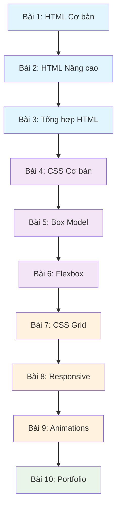

# 🎯 Series Bài tập HTML & CSS - Từ cơ bản đến nâng cao

## 📚 Tổng quan

Đây là một series gồm 10 bài tập được thiết kế để học viên học HTML và CSS một cách có hệ thống. Mỗi bài tập xây dựng dựa trên kiến thức của bài trước, đảm bảo sự liên kết và tiến bộ dần dần.

## 🎓 Lộ trình học tập

### **Giai đoạn 1: HTML Cơ bản (Bài 1-3)**
- **Bài 1:** HTML cơ bản - Cấu trúc và thẻ đơn giản
- **Bài 2:** HTML nâng cao - Form, table, semantic tags
- **Bài 3:** Tổng hợp HTML - Tạo trang web hoàn chỉnh

### **Giai đoạn 2: CSS Cơ bản (Bài 4-6)**
- **Bài 4:** CSS cơ bản - Selectors, colors, fonts
- **Bài 5:** CSS Box Model - Margin, padding, border
- **Bài 6:** CSS Layout - Flexbox cơ bản

### **Giai đoạn 3: CSS Nâng cao (Bài 7-9)**
- **Bài 7:** CSS Grid Layout
- **Bài 8:** Responsive Design với Media Queries
- **Bài 9:** CSS Animations và Transitions

### **Giai đoạn 4: Dự án tổng hợp (Bài 10)**
- **Bài 10:** Dự án cuối khóa - Portfolio website

## 📊 Thang điểm và thời gian

| Bài tập | Điểm | Thời gian ước tính | Độ khó |
|---------|------|-------------------|--------|
| Bài 1   | 20   | 2-3 giờ          | ⭐     |
| Bài 2   | 25   | 3-4 giờ          | ⭐⭐   |
| Bài 3   | 30   | 4-5 giờ          | ⭐⭐   |
| Bài 4   | 25   | 3-4 giờ          | ⭐⭐   |
| Bài 5   | 30   | 4-5 giờ          | ⭐⭐⭐ |
| Bài 6   | 35   | 5-6 giờ          | ⭐⭐⭐ |
| Bài 7   | 40   | 6-7 giờ          | ⭐⭐⭐⭐ |
| Bài 8   | 45   | 7-8 giờ          | ⭐⭐⭐⭐ |
| Bài 9   | 40   | 6-7 giờ          | ⭐⭐⭐⭐ |
| Bài 10  | 100  | 15-20 giờ        | ⭐⭐⭐⭐⭐ |

## 🔗 Kiến thức liên kết



## 📋 Quy tắc chung

### **Cách làm bài:**
1. Đọc kỹ yêu cầu trong file `README.md` của từng bài
2. Tạo nhánh mới: `exercise-[số-bài]-[tên-member]`
3. Làm bài trong folder tương ứng
4. Commit thường xuyên với message rõ ràng
5. Nộp bài qua Pull Request

### **Cấu trúc folder:**
```
exercises/
├── README.md (file này)
├── exercise-01/
│   ├── README.md
│   └── starter/ (file khởi tạo nếu có)
├── exercise-02/
│   ├── README.md
│   └── starter/
└── ...
```

### **Tiêu chí chấm điểm:**
- **Hoàn thành yêu cầu:** 60%
- **Code quality:** 20%
- **Thiết kế/UI:** 15%
- **Sáng tạo:** 5%

## 🎯 Mục tiêu học tập

Sau khi hoàn thành series này, học viên sẽ có thể:

✅ **HTML:**
- Hiểu và sử dụng thành thạo các thẻ HTML cơ bản và nâng cao
- Tạo form, table, và sử dụng semantic HTML
- Cấu trúc trang web đúng chuẩn

✅ **CSS:**
- Sử dụng selectors, properties cơ bản
- Hiểu và áp dụng Box Model
- Tạo layout với Flexbox và Grid
- Thiết kế responsive cho nhiều thiết bị
- Tạo animations và transitions

✅ **Best Practices:**
- Viết code sạch, có tổ chức
- Sử dụng naming conventions
- Tối ưu hóa performance
- Accessibility cơ bản

## 🚀 Bắt đầu

Hãy bắt đầu với [Bài tập 1: HTML Cơ bản](./exercise-01/README.md)

---

**Lưu ý:** Nếu gặp khó khăn, hãy xem lại tài liệu tham khảo trong [README.md chính](../README.md) hoặc liên hệ teacher để được hỗ trợ. 