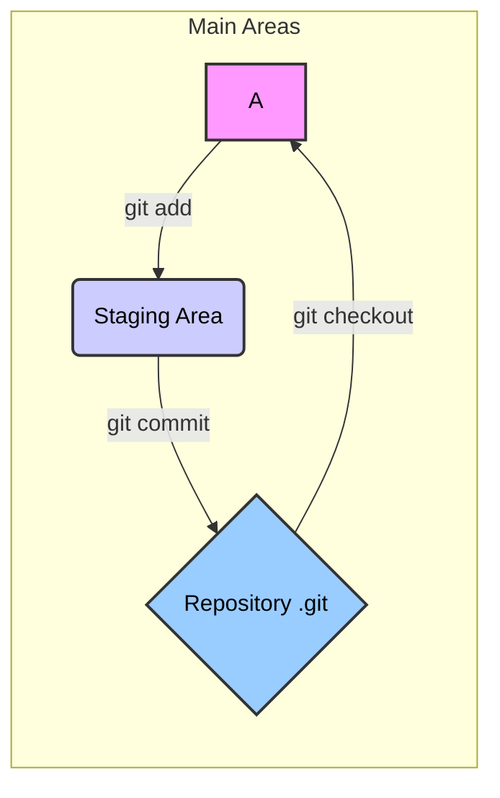
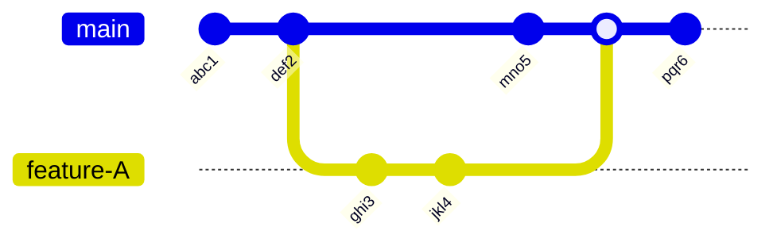
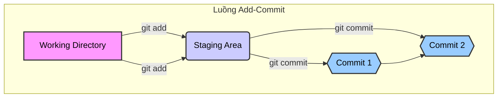
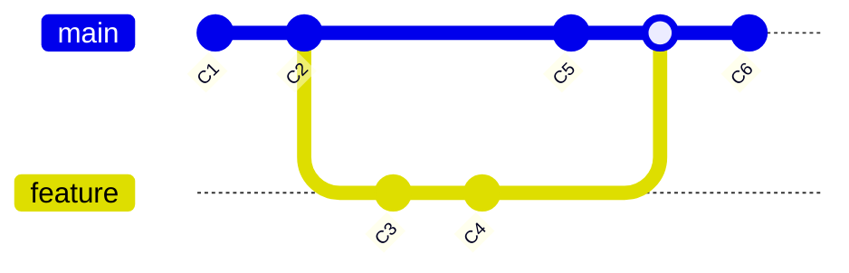
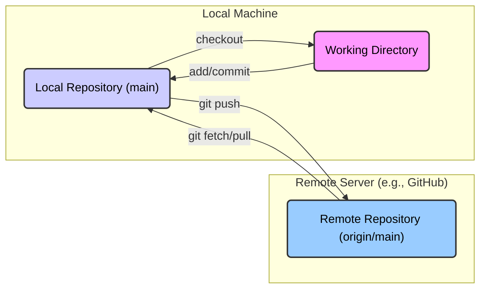

## Git là gì?

Git là một hệ thống quản lý phiên bản phân tán (Distributed Version Control System - DVCS) mã nguồn mở, được tạo ra bởi Linus Torvalds vào năm 2005 (cùng người đã tạo ra Linux). Mục tiêu ban đầu của Git là quản lý mã nguồn của nhân Linux, một dự án cực kỳ lớn với hàng ngàn người đóng góp. "Quản lý phiên bản" có nghĩa là Git giúp bạn theo dõi mọi thay đổi được thực hiện đối với các tệp trong dự án của bạn theo thời gian. Bạn có thể xem lại các phiên bản cũ, so sánh sự khác biệt giữa các phiên bản, và thậm chí quay trở lại một trạng thái trước đó nếu cần. "Phân tán" có nghĩa là mỗi nhà phát triển làm việc trên dự án sẽ có một bản sao đầy đủ của toàn bộ lịch sử dự án trên máy tính cá nhân của họ. Điều này khác biệt với các hệ thống quản lý phiên bản tập trung (Centralized Version Control Systems - CVCS) như Subversion (SVN), nơi lịch sử dự án chỉ được lưu trữ trên một máy chủ trung tâm.

## Tại sao nên sử dụng Git?

Việc sử dụng Git mang lại rất nhiều lợi ích, đặc biệt là trong các dự án có nhiều người tham gia hoặc các dự án phức tạp kéo dài:

*   **Theo dõi lịch sử thay đổi:** Git ghi lại chi tiết ai đã thay đổi cái gì, khi nào, và tại sao (thông qua các thông điệp commit). Điều này giúp bạn dễ dàng hiểu được quá trình phát triển của dự án và tìm ra nguyên nhân gây lỗi nếu có sự cố xảy ra.
*   **Làm việc nhóm hiệu quả:** Với mô hình phân tán, mỗi thành viên có thể làm việc độc lập trên bản sao dự án của mình mà không cần kết nối liên tục đến máy chủ trung tâm. Git cung cấp các công cụ mạnh mẽ để gộp (merge) các thay đổi từ nhiều người đóng góp lại với nhau một cách có kiểm soát, giảm thiểu xung đột và đảm bảo tính toàn vẹn của mã nguồn.
*   **Phân nhánh (Branching) linh hoạt:** Đây là một trong những tính năng mạnh mẽ nhất của Git. Bạn có thể tạo ra các "nhánh" riêng biệt để phát triển các tính năng mới, sửa lỗi, hoặc thử nghiệm ý tưởng mà không ảnh hưởng đến nhánh chính (thường là `main` hoặc `master`). Sau khi hoàn thành, bạn có thể dễ dàng gộp các thay đổi từ nhánh phụ trở lại nhánh chính.
*   **Khả năng phục hồi:** Vì mỗi người làm việc đều có bản sao đầy đủ lịch sử, nếu máy chủ trung tâm (nếu có) gặp sự cố, bạn vẫn có thể khôi phục lại toàn bộ dự án từ bất kỳ bản sao nào của các thành viên khác. Ngay cả khi bạn lỡ tay xóa file hoặc làm hỏng dự án trên máy mình, Git cũng giúp bạn dễ dàng quay lại các phiên bản ổn định trước đó.
*   **Miễn phí và mã nguồn mở:** Git hoàn toàn miễn phí và bạn có thể xem, sửa đổi mã nguồn của nó nếu muốn.
*   **Cộng đồng lớn và phổ biến:** Git là tiêu chuẩn công nghiệp de facto. Hầu hết các dự án mã nguồn mở và rất nhiều công ty lớn nhỏ đều sử dụng Git. Điều này có nghĩa là có rất nhiều tài liệu, hướng dẫn, công cụ hỗ trợ và một cộng đồng lớn sẵn sàng giúp đỡ bạn khi gặp khó khăn.

## Các khái niệm cơ bản

Trước khi đi sâu vào các lệnh cụ thể, hãy làm quen với một số thuật ngữ cốt lõi trong Git:

*   **Repository (Kho chứa - thường gọi tắt là Repo):** Đây là nơi lưu trữ toàn bộ dự án của bạn, bao gồm tất cả các tệp, thư mục và toàn bộ lịch sử thay đổi của chúng. Repo có thể nằm trên máy tính cá nhân của bạn (local repository) hoặc trên một máy chủ từ xa (remote repository) như GitHub, GitLab, Bitbucket.
*   **Commit (Lần lưu thay đổi):** Một commit đại diện cho một "ảnh chụp" (snapshot) trạng thái của dự án tại một thời điểm cụ thể. Mỗi commit lưu lại những thay đổi bạn đã thực hiện kể từ commit trước đó, kèm theo một thông điệp mô tả những thay đổi đó.
*   **Branch (Nhánh):** Một nhánh là một dòng phát triển độc lập trong dự án. Nhánh mặc định thường là `main` (hoặc `master` trong các dự án cũ). Bạn có thể tạo các nhánh mới để làm việc trên các tính năng hoặc sửa lỗi riêng biệt.
*   **Merge (Gộp):** Hành động kết hợp các thay đổi từ một nhánh vào một nhánh khác. Ví dụ, sau khi hoàn thành một tính năng trên nhánh `feature-X`, bạn sẽ gộp nó vào nhánh `main`.
*   **Remote (Kho chứa từ xa):** Một phiên bản của repository được lưu trữ trên một máy chủ khác, thường là trên internet (ví dụ: trên GitHub). Remote giúp bạn sao lưu dự án và cộng tác với người khác.
*   **Working Directory (Thư mục làm việc):** Thư mục trên máy tính của bạn chứa các tệp dự án mà bạn đang chỉnh sửa trực tiếp.
*   **Staging Area (Khu vực chuẩn bị - còn gọi là Index):** Một khu vực trung gian nơi bạn chuẩn bị các thay đổi trước khi thực hiện commit. Bạn chọn lọc những thay đổi nào từ Working Directory muốn đưa vào commit tiếp theo bằng cách thêm chúng vào Staging Area.
*   **HEAD:** Một con trỏ trỏ đến commit mới nhất trong nhánh hiện tại bạn đang làm việc.

Hiểu rõ các khái niệm này là bước đầu tiên để bạn có thể sử dụng Git một cách tự tin và hiệu quả. Trong các phần tiếp theo, chúng ta sẽ đi vào chi tiết cách cài đặt Git và thực hiện các thao tác cơ bản.


# Phần 2: Cài đặt và Cấu hình

Sau khi hiểu được những khái niệm cơ bản về Git, bước tiếp theo là cài đặt nó trên máy tính của bạn và thực hiện một vài cấu hình ban đầu. Quá trình cài đặt khá đơn giản trên hầu hết các hệ điều hành phổ biến.

## Cài đặt Git

Git có thể được cài đặt trên Windows, macOS và Linux. Dưới đây là hướng dẫn cho từng hệ điều hành:

### macOS

Có một số cách để cài đặt Git trên macOS:

1.  **Thông qua Xcode Command Line Tools:** Nếu bạn đã cài đặt Xcode (môi trường phát triển của Apple), Git có thể đã được cài đặt sẵn. Nếu chưa, cách dễ nhất là mở Terminal (trong Applications > Utilities) và gõ lệnh:
    ```bash
    git --version
    ```
    Nếu Git chưa được cài đặt, hệ thống sẽ tự động đề nghị bạn cài đặt Command Line Tools, bao gồm cả Git. Chỉ cần làm theo hướng dẫn trên màn hình.

2.  **Thông qua trình cài đặt độc lập:** Bạn có thể tải về trình cài đặt Git mới nhất cho macOS từ trang web Git:
    [https://git-scm.com/download/mac](https://git-scm.com/download/mac)
    Tải về tệp `.dmg` và chạy nó để cài đặt.

3.  **Thông qua Homebrew (Trình quản lý gói):** Nếu bạn đã cài đặt Homebrew, bạn có thể cài đặt Git bằng lệnh đơn giản trong Terminal:
    ```bash
    brew install git
    ```

Sau khi cài đặt, hãy kiểm tra lại bằng lệnh `git --version` trong Terminal.

## Cấu hình Git lần đầu

Sau khi cài đặt Git thành công, có một vài cấu hình cơ bản bạn nên thực hiện. Git sử dụng thông tin này để gắn vào các commit bạn tạo ra. Bạn chỉ cần thực hiện việc này một lần trên mỗi máy tính.

Mở terminal (Git Bash trên Windows, Terminal trên macOS/Linux) và chạy các lệnh sau, thay thế "Your Name" và "your.email@example.com" bằng tên và địa chỉ email của bạn:

```bash
git config --global user.name "Your Name"
git config --global user.email "your.email@example.com"
```

Cờ `--global` có nghĩa là cấu hình này sẽ áp dụng cho tất cả các dự án Git trên máy tính của bạn. Nếu bạn muốn sử dụng tên hoặc email khác cho một dự án cụ thể, bạn có thể chạy các lệnh tương tự mà không có cờ `--global` bên trong thư mục của dự án đó.

Bạn có thể kiểm tra lại các cấu hình đã thiết lập bằng lệnh:

```bash
git config --list
```

Lệnh này sẽ liệt kê tất cả các cấu hình Git, bao gồm cả tên và email bạn vừa thiết lập.

Ngoài ra, bạn có thể muốn cấu hình trình soạn thảo mặc định (nếu chưa làm trong quá trình cài đặt trên Windows) hoặc thay đổi màu sắc hiển thị của Git. Ví dụ, để đặt VS Code làm trình soạn thảo mặc định:

```bash
git config --global core.editor "code --wait"
```

(Lệnh cụ thể có thể thay đổi tùy thuộc vào cách bạn cài đặt VS Code và hệ điều hành).

Với Git đã được cài đặt và cấu hình cơ bản, bạn đã sẵn sàng để bắt đầu sử dụng nó để quản lý các dự án của mình. Trong phần tiếp theo, chúng ta sẽ khám phá các khái niệm cốt lõi và luồng công việc cơ bản trong Git.


# Phần 3: Các khái niệm cốt lõi và Luồng công việc cơ bản

Bây giờ bạn đã cài đặt và cấu hình Git, đã đến lúc tìm hiểu sâu hơn về cách Git hoạt động và thực hiện các thao tác cơ bản nhất. Phần này sẽ giới thiệu các khái niệm cốt lõi như Working Directory, Staging Area, Repository, cách khởi tạo hoặc sao chép một dự án, và quy trình làm việc cơ bản để theo dõi thay đổi.

## Khởi tạo Repository (`git init`)

Để bắt đầu sử dụng Git cho một dự án mới chưa được theo dõi, bạn cần khởi tạo một Git repository ngay trong thư mục gốc của dự án đó. Mở terminal, di chuyển đến thư mục dự án của bạn bằng lệnh `cd` (change directory), và chạy lệnh:

```bash
git init
```

Lệnh này sẽ tạo một thư mục con ẩn có tên là `.git` bên trong thư mục dự án của bạn. Thư mục `.git` này chứa tất cả thông tin cần thiết cho repository, bao gồm toàn bộ lịch sử thay đổi, cấu hình, thông tin về các nhánh, v.v. Đây chính là "bộ não" của Git cho dự án này. Sau khi chạy `git init`, Git sẽ bắt đầu theo dõi các tệp trong thư mục dự án, nhưng chưa có tệp nào được đưa vào quản lý phiên bản chính thức cho đến khi bạn thực hiện commit đầu tiên.

## Sao chép Repository (`git clone`)

Nếu bạn muốn làm việc trên một dự án đã có sẵn Git repository (ví dụ, một dự án mã nguồn mở trên GitHub hoặc một dự án của đồng nghiệp), bạn không cần dùng `git init`. Thay vào đó, bạn sẽ "sao chép" (clone) repository đó về máy tính của mình. Lệnh `git clone` sẽ tải về toàn bộ bản sao của repository từ xa, bao gồm tất cả các tệp, lịch sử commit, và các nhánh, đồng thời tự động tạo thư mục dự án trên máy bạn và thiết lập kết nối đến remote repository (thường gọi là `origin`).

Sử dụng lệnh sau, thay `<URL>` bằng địa chỉ URL của repository bạn muốn sao chép:

```bash
git clone <URL>
```

Ví dụ, để sao chép một dự án từ GitHub:

```bash
git clone https://github.com/ten-nguoi-dung/ten-repo.git
```

Sau khi lệnh hoàn tất, bạn sẽ có một thư mục mới tên là `ten-repo` chứa toàn bộ dự án và lịch sử Git của nó.

## Kiểm tra trạng thái (`git status`)

Đây là một trong những lệnh bạn sẽ sử dụng thường xuyên nhất. Lệnh `git status` cho bạn biết trạng thái hiện tại của repository: bạn đang ở nhánh nào, có những thay đổi nào trong Working Directory chưa được đưa vào Staging Area, và có những thay đổi nào trong Staging Area sẵn sàng để được commit.

```bash
git status
```

Kết quả của `git status` sẽ cung cấp thông tin rõ ràng về các tệp đã bị sửa đổi (modified), các tệp mới chưa được theo dõi (untracked), và các tệp đã được đưa vào Staging Area (changes to be committed).

## Working Directory, Staging Area, và Repository

Để hiểu rõ luồng công việc của Git, điều quan trọng là phải nắm vững ba khu vực chính mà Git quản lý các tệp của bạn:

1.  **Working Directory (Thư mục làm việc):** Đây là nơi bạn thực sự làm việc - thư mục chứa các tệp dự án mà bạn có thể xem và chỉnh sửa trực tiếp bằng trình soạn thảo mã hoặc các công cụ khác. Bất kỳ thay đổi nào bạn thực hiện (thêm, sửa, xóa tệp) đều diễn ra ở đây.

2.  **Staging Area (Khu vực chuẩn bị - còn gọi là Index):** Đây là một tệp đặc biệt nằm trong thư mục `.git`, hoạt động như một khu vực trung gian. Nó lưu trữ thông tin về những thay đổi nào từ Working Directory mà bạn muốn đưa vào commit tiếp theo. Bạn sử dụng lệnh `git add` để "đưa" (stage) các thay đổi từ Working Directory vào Staging Area.

3.  **Repository (Kho chứa - thư mục `.git`):** Đây là nơi Git lưu trữ vĩnh viễn các commit của bạn. Khi bạn thực hiện lệnh `git commit`, Git sẽ lấy các thay đổi đã được chuẩn bị trong Staging Area, tạo một snapshot mới (commit), và lưu nó vào lịch sử của repository.

Luồng công việc cơ bản là: bạn chỉnh sửa tệp trong Working Directory, sau đó chọn lọc những thay đổi muốn lưu bằng cách đưa chúng vào Staging Area (`git add`), và cuối cùng lưu những thay đổi đó thành một commit trong Repository (`git commit`).



*Sơ đồ: Luồng dữ liệu giữa Working Directory, Staging Area và Repository.*

## Thêm thay đổi vào Staging Area (`git add`)

Sau khi bạn đã chỉnh sửa hoặc tạo mới các tệp trong Working Directory, bạn cần cho Git biết những thay đổi nào bạn muốn bao gồm trong commit tiếp theo. Lệnh `git add` được sử dụng để làm điều này. Nó lấy nội dung hiện tại của tệp và đưa nó vào Staging Area.

Để thêm một tệp cụ thể:

```bash
git add <tên-file>
```

Để thêm tất cả các thay đổi (tệp mới, tệp bị sửa đổi, tệp bị xóa) trong thư mục hiện tại và các thư mục con vào Staging Area:

```bash
git add .
```

Hoặc:

```bash
git add -A
```

Sau khi chạy `git add`, nếu bạn chạy lại `git status`, bạn sẽ thấy các tệp đó được liệt kê trong phần "Changes to be committed".

## Lưu thay đổi vào Repository (`git commit`)

Khi bạn đã hài lòng với các thay đổi đã được chuẩn bị trong Staging Area, bạn có thể lưu chúng vĩnh viễn vào lịch sử repository bằng lệnh `git commit`. Mỗi commit là một bản ghi lại trạng thái của dự án tại một thời điểm, và nó luôn đi kèm với một thông điệp mô tả những gì đã thay đổi (commit message). Viết commit message rõ ràng và có ý nghĩa là rất quan trọng để theo dõi lịch sử sau này.

Cách phổ biến nhất để commit là sử dụng cờ `-m` để cung cấp thông điệp commit trực tiếp trên dòng lệnh:

```bash
git commit -m "Thông điệp mô tả commit của bạn"
```

Ví dụ:

```bash
git commit -m "Thêm chức năng đăng nhập người dùng"
```

Nếu bạn không dùng cờ `-m`, Git sẽ mở trình soạn thảo văn bản mặc định (mà bạn đã cấu hình) để bạn nhập thông điệp commit. Thông điệp commit thường bao gồm một dòng tiêu đề ngắn gọn (dưới 50 ký tự) và có thể có thêm phần mô tả chi tiết hơn ở các dòng sau, cách nhau bởi một dòng trống.

Mỗi commit có một mã định danh duy nhất (SHA-1 hash) và nó liên kết với commit trước đó, tạo thành một chuỗi lịch sử. Con trỏ `HEAD` thường trỏ đến commit mới nhất trên nhánh hiện tại bạn đang làm việc.



*Sơ đồ: Minh họa chuỗi các commit và cách `HEAD` (thường đi cùng tên nhánh) di chuyển khi có commit mới hoặc khi chuyển nhánh.*

## Xem lịch sử commit (`git log`)

Để xem lại lịch sử các commit đã được thực hiện trong repository, bạn sử dụng lệnh `git log`:

```bash
git log
```

Lệnh này sẽ hiển thị danh sách các commit theo thứ tự thời gian từ mới nhất đến cũ nhất. Mỗi mục log thường bao gồm:

*   Mã SHA-1 hash đầy đủ của commit.
*   Tên và email của tác giả (Author).
*   Ngày tháng thực hiện commit (Date).
*   Thông điệp commit.

Lệnh `git log` có rất nhiều tùy chọn để tùy chỉnh định dạng hiển thị. Một số tùy chọn hữu ích:

*   `git log --oneline`: Hiển thị mỗi commit trên một dòng, bao gồm mã hash rút gọn và tiêu đề commit.
*   `git log --graph`: Hiển thị lịch sử dưới dạng đồ thị ASCII, rất hữu ích khi xem các nhánh và merge.
*   `git log --stat`: Hiển thị thống kê các tệp đã thay đổi trong mỗi commit.
*   `git log -p`: Hiển thị chi tiết các thay đổi (diff) được giới thiệu trong mỗi commit.
*   `git log -n <số lượng>`: Giới hạn số lượng commit hiển thị. Ví dụ: `git log -n 5` chỉ hiển thị 5 commit gần nhất.



*Sơ đồ: Luồng công việc cơ bản `add` -> `commit` lặp lại.*

Nắm vững các lệnh `init`, `clone`, `status`, `add`, `commit`, và `log` cùng với khái niệm về Working Directory, Staging Area, và Repository là nền tảng để bạn bắt đầu làm việc hiệu quả với Git. Trong phần tiếp theo, chúng ta sẽ khám phá một trong những tính năng mạnh mẽ nhất của Git: phân nhánh và gộp nhánh.


# Phần 4: Nhánh (Branching) và Gộp (Merging)

Một trong những tính năng mạnh mẽ và hữu ích nhất của Git chính là khả năng phân nhánh (branching). Nhánh cho phép bạn tạo ra các môi trường làm việc độc lập bên trong cùng một repository. Điều này cực kỳ quan trọng khi bạn muốn phát triển một tính năng mới, sửa một lỗi phức tạp, hoặc thử nghiệm một ý tưởng mà không làm ảnh hưởng đến phiên bản ổn định của dự án (thường nằm trên nhánh `main` hoặc `master`). Sau khi công việc trên nhánh hoàn tất, bạn có thể gộp (merge) những thay đổi đó trở lại nhánh chính.

## Nhánh là gì? Tại sao cần dùng nhánh?

Hãy tưởng tượng lịch sử commit của bạn như một con đường thẳng. Mỗi commit là một cột mốc trên con đường đó. Khi bạn tạo một nhánh mới, bạn thực chất đang tạo ra một con đường rẽ từ một cột mốc nào đó. Bạn có thể tiếp tục đi trên con đường rẽ này (thêm các commit mới) mà không ảnh hưởng gì đến con đường chính ban đầu. Nhánh trong Git thực chất chỉ là một con trỏ nhẹ nhàng trỏ đến một commit cụ thể. Nhánh mặc định khi bạn khởi tạo repository thường là `main`.

Tại sao lại cần dùng nhánh?

*   **Phát triển tính năng song song:** Nhiều người có thể làm việc trên các tính năng khác nhau cùng lúc trên các nhánh riêng biệt mà không gây cản trở lẫn nhau.
*   **Cô lập thay đổi:** Khi phát triển tính năng mới hoặc sửa lỗi, bạn có thể thực hiện trên một nhánh riêng. Nếu có vấn đề xảy ra hoặc bạn quyết định không tiếp tục, bạn có thể dễ dàng hủy bỏ nhánh đó mà không ảnh hưởng đến nhánh chính.
*   **Quy trình làm việc có tổ chức:** Sử dụng nhánh giúp tổ chức quy trình phát triển rõ ràng hơn (ví dụ: nhánh `develop` cho phát triển, nhánh `feature/*` cho các tính năng mới, nhánh `hotfix/*` cho các bản vá lỗi khẩn cấp).
*   **Thử nghiệm an toàn:** Bạn có thể tạo nhánh để thử nghiệm các thư viện mới, cấu trúc lại mã nguồn, hoặc thực hiện các thay đổi lớn mà không sợ làm hỏng phiên bản đang hoạt động.

## Tạo nhánh mới

Để tạo một nhánh mới, bạn sử dụng lệnh `git branch` theo sau là tên nhánh bạn muốn tạo:

```bash
git branch <tên-nhánh>
```

Ví dụ, để tạo một nhánh tên là `feature-login`:

```bash
git branch feature-login
```

Lệnh này chỉ tạo ra nhánh mới dựa trên commit hiện tại bạn đang đứng (HEAD), nhưng nó **không** tự động chuyển bạn sang nhánh đó. Bạn vẫn đang ở nhánh cũ.

Để xem danh sách tất cả các nhánh trong repository và biết bạn đang ở nhánh nào (được đánh dấu bằng dấu `*`), dùng lệnh:

```bash
git branch
```

## Chuyển đổi giữa các nhánh

Để bắt đầu làm việc trên một nhánh khác (đã tồn tại), bạn cần "chuyển" (checkout) sang nhánh đó. Lệnh `git checkout` được sử dụng cho mục đích này:

```bash
git checkout <tên-nhánh>
```

Ví dụ, để chuyển sang nhánh `feature-login` vừa tạo:

```bash
git checkout feature-login
```

Sau khi chạy lệnh này, Working Directory của bạn sẽ được cập nhật để phản ánh trạng thái của commit cuối cùng trên nhánh `feature-login`, và con trỏ `HEAD` sẽ trỏ đến nhánh này. Mọi commit bạn thực hiện từ bây giờ sẽ được thêm vào nhánh `feature-login`.

**Lối tắt:** Bạn có thể tạo và chuyển sang nhánh mới cùng lúc bằng cách sử dụng cờ `-b` với `git checkout`:

```bash
git checkout -b <tên-nhánh-mới>
```

Ví dụ:

```bash
git checkout -b feature-registration
```

Lệnh này tương đương với việc chạy `git branch feature-registration` rồi `git checkout feature-registration`.

**Lệnh `git switch` (Mới hơn):** Kể từ phiên bản Git 2.23, lệnh `git switch` được giới thiệu như một giải pháp thay thế rõ ràng hơn cho `git checkout` khi chỉ thực hiện việc chuyển nhánh. Để chuyển sang nhánh đã có:

```bash
git switch <tên-nhánh>
```

Để tạo và chuyển sang nhánh mới:

```bash
git switch -c <tên-nhánh-mới>
```

Sử dụng `git switch` giúp tránh nhầm lẫn vì `git checkout` còn được dùng cho nhiều mục đích khác (như hoàn tác thay đổi tệp).

## Gộp nhánh (`git merge`)

Sau khi bạn đã hoàn thành công việc trên một nhánh (ví dụ: nhánh `feature-login`) và muốn tích hợp những thay đổi đó vào một nhánh khác (thường là nhánh `main` hoặc `develop`), bạn sẽ thực hiện thao tác "gộp" (merge).

Quy trình gộp thường bao gồm các bước sau:

1.  Chuyển về nhánh đích mà bạn muốn gộp thay đổi vào (ví dụ: `main`):
    ```bash
    git switch main # hoặc git checkout main
    ```
2.  Đảm bảo nhánh đích của bạn được cập nhật mới nhất (nếu làm việc với remote, bạn có thể cần `git pull`).
3.  Thực hiện lệnh `git merge` với tên của nhánh nguồn (nhánh chứa các thay đổi bạn muốn gộp):
    ```bash
    git merge <tên-nhánh-nguồn>
    ```
    Ví dụ, để gộp nhánh `feature-login` vào nhánh `main`:
    ```bash
    git merge feature-login
    ```

Git sẽ cố gắng tự động gộp các thay đổi. Có hai kiểu gộp chính:

*   **Fast-forward merge:** Nếu nhánh đích (`main`) không có commit nào mới kể từ khi nhánh nguồn (`feature-login`) được tạo ra, Git chỉ đơn giản là di chuyển con trỏ của nhánh đích lên commit cuối cùng của nhánh nguồn. Lịch sử vẫn là một đường thẳng.
*   **Three-way merge:** Nếu cả nhánh đích và nhánh nguồn đều có các commit mới kể từ điểm chia tách, Git sẽ tìm commit tổ tiên chung gần nhất và tạo ra một "merge commit" mới. Merge commit này có hai commit cha (commit cuối cùng của nhánh đích và commit cuối cùng của nhánh nguồn) và nó chứa kết quả của việc kết hợp các thay đổi từ cả hai nhánh.



*Sơ đồ: Minh họa quá trình tạo nhánh `feature` từ `main` (sau C2), thêm commit (C3, C4) vào `feature`, thêm commit (C5) vào `main`, sau đó gộp `feature` vào `main` tạo thành merge commit (C6).*

## Giải quyết xung đột (Merge Conflicts)

Đôi khi, Git không thể tự động gộp các thay đổi vì có sự xung đột (conflict). Xung đột xảy ra khi cùng một phần của cùng một tệp đã được sửa đổi khác nhau trên cả hai nhánh đang được gộp. Ví dụ, cả nhánh `main` và nhánh `feature-login` đều sửa đổi dòng thứ 10 của tệp `config.txt`.

Khi xung đột xảy ra, `git merge` sẽ thất bại và Git sẽ đánh dấu các tệp bị xung đột trong Working Directory. Bạn cần phải tự mình giải quyết các xung đột này:

1.  Mở các tệp bị xung đột (Git sẽ cho bạn biết tệp nào). Bên trong tệp, Git sẽ chèn các dấu đặc biệt để chỉ ra các phần bị xung đột:
    ```
    <<<<<<< HEAD
    Nội dung từ nhánh hiện tại (ví dụ: main)
    =======
    Nội dung từ nhánh đang gộp (ví dụ: feature-login)
    >>>>>>> feature-login
    ```
2.  Chỉnh sửa tệp để giữ lại phiên bản đúng của mã nguồn. Bạn cần xóa các dấu `<<<<<<<`, `=======`, `>>>>>>>` và quyết định xem nên giữ lại phần nào, kết hợp cả hai, hay viết lại hoàn toàn phần đó.
3.  Sau khi đã chỉnh sửa và lưu tất cả các tệp bị xung đột, hãy thêm chúng vào Staging Area:
    ```bash
    git add <tên-file-đã-giải-quyết-xung-đột>
    ```
4.  Cuối cùng, thực hiện commit để hoàn tất việc gộp. Git thường sẽ tự động tạo sẵn một thông điệp commit cho merge commit, bạn chỉ cần xác nhận nó (hoặc có thể chỉnh sửa nếu muốn):
    ```bash
    git commit
    ```

Giải quyết xung đột là một kỹ năng quan trọng khi làm việc với Git, đặc biệt là trong các nhóm lớn. Sử dụng các công cụ hỗ trợ merge (merge tools) có giao diện đồ họa cũng có thể giúp quá trình này dễ dàng hơn.

Sau khi gộp thành công và không cần đến nhánh tính năng nữa, bạn có thể xóa nó đi (tùy chọn):

```bash
git branch -d <tên-nhánh-đã-gộp>
```

Ví dụ:

```bash
git branch -d feature-login
```

Lưu ý: Cờ `-d` chỉ xóa nhánh nếu nó đã được gộp hoàn toàn vào nhánh hiện tại. Nếu bạn muốn ép xóa một nhánh chưa được gộp (cẩn thận!), hãy dùng cờ `-D`.

Phân nhánh và gộp là cốt lõi của nhiều quy trình làm việc Git hiện đại, cho phép phát triển linh hoạt và an toàn. Trong phần tiếp theo, chúng ta sẽ tìm hiểu cách làm việc với các repository từ xa.


# Phần 5: Làm việc với Remote Repository

Cho đến nay, chúng ta chủ yếu làm việc với Git trên máy tính cá nhân (local repository). Tuy nhiên, sức mạnh thực sự của Git, đặc biệt trong môi trường cộng tác, đến từ khả năng làm việc với các kho chứa từ xa (remote repositories). Remote repository là phiên bản của dự án được lưu trữ trên một máy chủ khác, thường là trên internet, thông qua các dịch vụ như GitHub, GitLab, Bitbucket, hoặc máy chủ Git riêng của công ty bạn.

Làm việc với remote cho phép bạn:

*   **Sao lưu dự án:** Lưu trữ một bản sao dự án ở nơi khác phòng khi máy tính cá nhân gặp sự cố.
*   **Cộng tác với người khác:** Nhiều người có thể cùng đóng góp vào một dự án bằng cách đẩy (push) các thay đổi của họ lên remote và kéo (pull) các thay đổi của người khác về máy mình.
*   **Triển khai ứng dụng:** Remote repository thường là điểm trung gian để triển khai mã nguồn lên môi trường production.

## Remote Repository là gì?

Khi bạn `git clone` một dự án, Git tự động thiết lập một kết nối đến repository gốc mà bạn đã sao chép. Kết nối này được gọi là một "remote". Theo quy ước, remote mặc định này thường được đặt tên là `origin`. Bạn có thể có nhiều remote cho một dự án (ví dụ: một remote trỏ đến kho chứa chính thức, một remote khác trỏ đến kho chứa của đồng nghiệp).

Để xem danh sách các remote đã được cấu hình cho dự án của bạn, dùng lệnh:

```bash
git remote -v
```

Lệnh này sẽ hiển thị tên của các remote (ví dụ: `origin`) và URL tương ứng cho việc lấy dữ liệu (fetch) và đẩy dữ liệu (push).

## Thêm Remote Repository (`git remote add`)

Nếu bạn khởi tạo một repository bằng `git init` trên máy local và muốn liên kết nó với một remote repository mới được tạo trên GitHub (hoặc dịch vụ tương tự), bạn cần phải thêm remote đó vào cấu hình Git của mình. Sử dụng lệnh `git remote add`:

```bash
git remote add <tên-remote> <URL-cua-remote-repository>
```

Theo quy ước, tên remote chính thường là `origin`.

Ví dụ, nếu bạn đã tạo một repository trống trên GitHub có URL là `https://github.com/user/my-project.git`, bạn sẽ thêm nó vào dự án local như sau:

```bash
git remote add origin https://github.com/user/my-project.git
```

Sau đó, bạn có thể kiểm tra lại bằng `git remote -v`.

## Đẩy thay đổi lên Remote (`git push`)

Khi bạn đã thực hiện các commit trên local repository và muốn chia sẻ những thay đổi đó lên remote repository (ví dụ: `origin`), bạn sử dụng lệnh `git push`. Lệnh này sẽ tải các commit từ nhánh local của bạn lên nhánh tương ứng trên remote.

Cú pháp cơ bản:

```bash
git push <tên-remote> <tên-nhánh-local>
```

Ví dụ, để đẩy các commit từ nhánh `main` ở local lên nhánh `main` của remote `origin`:

```bash
git push origin main
```

Lần đầu tiên bạn đẩy một nhánh mới lên remote, bạn có thể cần sử dụng cờ `-u` (hoặc `--set-upstream`) để thiết lập mối liên kết theo dõi (tracking relationship) giữa nhánh local và nhánh remote. Điều này cho phép bạn sau này chỉ cần gõ `git push` mà không cần chỉ định tên remote và nhánh.

```bash
git push -u origin main
```

Sau lần thiết lập này, những lần đẩy tiếp theo trên nhánh `main`, bạn chỉ cần gõ `git push`.

**Lưu ý:** Git chỉ cho phép bạn push nếu lịch sử commit trên remote là tổ tiên trực tiếp của lịch sử commit trên local của bạn. Nếu có những thay đổi trên remote mà bạn chưa có ở local (ví dụ: người khác đã push lên trước), Git sẽ từ chối push và yêu cầu bạn phải kéo (pull) các thay đổi đó về trước.

## Lấy thay đổi từ Remote (`git pull`)

Để cập nhật local repository của bạn với những thay đổi mới nhất từ remote repository (ví dụ: những thay đổi mà đồng nghiệp đã push lên `origin`), bạn sử dụng lệnh `git pull`. Lệnh này thực hiện hai việc:

1.  **Fetch:** Tải về các đối tượng và commit mới từ nhánh được theo dõi trên remote mà bạn chưa có ở local.
2.  **Merge:** Tự động gộp (merge) các thay đổi vừa tải về từ nhánh remote vào nhánh local hiện tại của bạn.

Cú pháp cơ bản:

```bash
git pull <tên-remote> <tên-nhánh-remote>
```

Ví dụ, để lấy và gộp các thay đổi từ nhánh `main` của remote `origin` vào nhánh `main` hiện tại ở local:

```bash
git pull origin main
```

Nếu bạn đã thiết lập liên kết theo dõi (ví dụ bằng `git push -u` hoặc khi `git clone`), bạn thường chỉ cần gõ:

```bash
git pull
```

Git sẽ tự động biết cần lấy thay đổi từ nhánh nào trên remote `origin` để gộp vào nhánh hiện tại.

Nếu có xung đột xảy ra trong quá trình merge tự động của `git pull`, bạn sẽ cần phải giải quyết xung đột giống như khi thực hiện `git merge` thông thường.

## Lấy thông tin từ Remote mà không gộp (`git fetch`)

Đôi khi, bạn chỉ muốn xem có những thay đổi gì mới trên remote mà không muốn tự động gộp chúng vào nhánh local ngay lập tức. Lệnh `git fetch` thực hiện điều này. Nó chỉ tải về các đối tượng và commit mới từ remote và cập nhật các con trỏ remote-tracking branch (ví dụ: `origin/main`) trong local repository của bạn, nhưng **không** thay đổi Working Directory hay nhánh local hiện tại của bạn.

```bash
git fetch <tên-remote>
```

Ví dụ:

```bash
git fetch origin
```

Sau khi `fetch`, bạn có thể:

*   So sánh nhánh local của bạn với nhánh remote-tracking tương ứng để xem sự khác biệt: `git diff main origin/main`
*   Xem log của nhánh remote-tracking: `git log origin/main`
*   Quyết định gộp các thay đổi một cách thủ công: `git merge origin/main` (khi đang ở nhánh `main`)

Sử dụng `git fetch` cho phép bạn kiểm tra các thay đổi từ remote trước khi tích hợp chúng vào công việc của mình, giúp kiểm soát tốt hơn so với `git pull`.



*Sơ đồ: Minh họa tương tác giữa Local Repository và Remote Repository thông qua `push` và `pull`/`fetch`.*

Việc hiểu và sử dụng thành thạo các lệnh làm việc với remote là rất quan trọng để cộng tác hiệu quả trong các dự án sử dụng Git. Trong phần tiếp theo, chúng ta sẽ tìm hiểu cách hoàn tác các thay đổi không mong muốn.


# Phần 6: Hoàn tác thay đổi

Trong quá trình làm việc với Git, việc mắc lỗi hoặc thay đổi ý định là điều không thể tránh khỏi. May mắn thay, Git cung cấp nhiều công cụ mạnh mẽ để giúp bạn hoàn tác các thay đổi ở nhiều cấp độ khác nhau, từ những chỉnh sửa nhỏ trong Working Directory đến việc quay lại các commit cũ trong lịch sử.

## Bỏ qua thay đổi trong Working Directory (`git checkout -- <tên-file>` hoặc `git restore`)

Nếu bạn đã sửa đổi một tệp trong Working Directory nhưng chưa đưa nó vào Staging Area (`git add`) và bạn muốn hủy bỏ hoàn toàn những thay đổi đó để quay lại phiên bản gần nhất đã được commit (hoặc được stage), bạn có thể sử dụng lệnh `git checkout --` hoặc lệnh mới hơn là `git restore`.

**Sử dụng `git checkout --` (Cẩn thận!):**

```bash
git checkout -- <tên-file>
```

Ví dụ, để hủy bỏ mọi thay đổi trong tệp `style.css` kể từ lần commit cuối:

```bash
git checkout -- style.css
```

**Cảnh báo:** Lệnh này rất nguy hiểm vì nó sẽ ghi đè lên tệp trong Working Directory của bạn bằng phiên bản từ commit gần nhất (hoặc Staging Area nếu tệp đã được stage trước đó). Mọi thay đổi bạn đã thực hiện trên tệp đó kể từ lần commit/stage cuối sẽ bị **mất vĩnh viễn**. Hãy chắc chắn rằng bạn thực sự muốn hủy bỏ các thay đổi trước khi chạy lệnh này.

Để hủy bỏ thay đổi cho tất cả các tệp đã sửa đổi trong thư mục hiện tại:

```bash
git checkout -- .
```

**Sử dụng `git restore` (An toàn hơn và rõ ràng hơn):**

Kể từ Git 2.23, lệnh `git restore` được giới thiệu để xử lý việc hoàn tác thay đổi trong Working Directory một cách rõ ràng hơn.

Để hủy bỏ thay đổi trong Working Directory cho một tệp cụ thể (quay lại trạng thái của Staging Area nếu có, hoặc HEAD nếu chưa stage):

```bash
git restore <tên-file>
```

Ví dụ:

```bash
git restore style.css
```

Lệnh này có chức năng tương tự `git checkout -- <tên-file>` nhưng tên lệnh rõ ràng hơn về mục đích hoàn tác.

## Bỏ qua thay đổi trong Staging Area (`git reset HEAD <tên-file>` hoặc `git restore --staged`)

Nếu bạn đã sử dụng `git add` để đưa các thay đổi vào Staging Area nhưng sau đó quyết định không muốn commit những thay đổi đó nữa (hoặc muốn chỉnh sửa thêm trước khi commit), bạn cần "bỏ stage" (unstage) chúng. Thao tác này sẽ đưa các thay đổi trở lại Working Directory, nhưng không làm mất các chỉnh sửa bạn đã thực hiện.

**Sử dụng `git reset HEAD`:**

```bash
git reset HEAD <tên-file>
```

Ví dụ, để bỏ stage tệp `script.js`:

```bash
git reset HEAD script.js
```

Lệnh này chỉ ảnh hưởng đến Staging Area, các thay đổi vẫn còn trong Working Directory của bạn. Nếu bạn muốn bỏ stage tất cả các tệp:

```bash
git reset HEAD .
```

**Sử dụng `git restore --staged` (Rõ ràng hơn):**

Lệnh `git restore` cũng cung cấp một cách rõ ràng hơn để bỏ stage các thay đổi:

```bash
git restore --staged <tên-file>
```

Ví dụ:

```bash
git restore --staged script.js
```

Lệnh này thực hiện chính xác điều tương tự như `git reset HEAD <tên-file>`.

Sau khi bỏ stage, bạn có thể chỉnh sửa lại tệp trong Working Directory rồi `git add` lại, hoặc hủy bỏ hoàn toàn thay đổi trong Working Directory bằng `git restore <tên-file>` (hoặc `git checkout -- <tên-file>`).

## Quay lại một commit trước đó (`git reset`)

Đôi khi, bạn nhận ra rằng một hoặc nhiều commit gần đây là sai lầm và bạn muốn quay lại trạng thái của một commit cũ hơn. Lệnh `git reset` cho phép bạn làm điều này, nhưng nó có thể ảnh hưởng đến lịch sử commit và cần được sử dụng cẩn thận, đặc biệt là đối với các commit đã được đẩy lên remote.

`git reset` có ba chế độ chính, ảnh hưởng đến ba khu vực (Working Directory, Staging Area, Repository):

1.  **`--soft`:** Chỉ di chuyển con trỏ `HEAD` đến commit được chỉ định. Lịch sử commit thay đổi, nhưng Staging Area và Working Directory không bị ảnh hưởng. Các thay đổi từ các commit bị "reset" sẽ xuất hiện trong Staging Area như thể chúng vừa được `git add`.
    ```bash
    git reset --soft <commit-hash-hoặc-tham-chiếu>
    ```
    Ví dụ, quay lại commit trước đó, giữ nguyên thay đổi trong Staging Area:
    ```bash
    git reset --soft HEAD~
    ```
    (`HEAD~` hoặc `HEAD~1` tham chiếu đến commit ngay trước HEAD).

2.  **`--mixed` (Mặc định):** Di chuyển `HEAD` và cập nhật Staging Area để khớp với commit được chỉ định. Working Directory không bị thay đổi. Các thay đổi từ các commit bị "reset" sẽ xuất hiện trong Working Directory như những thay đổi chưa được stage.
    ```bash
    git reset --mixed <commit-hash-hoặc-tham-chiếu>
    # hoặc đơn giản là:
    git reset <commit-hash-hoặc-tham-chiếu>
    ```
    Ví dụ, quay lại commit trước đó, đưa thay đổi vào Working Directory:
    ```bash
    git reset HEAD~
    ```
    Đây là chế độ mặc định nếu bạn không chỉ định `--soft` hay `--hard`.

3.  **`--hard` (Cẩn thận!):** Di chuyển `HEAD`, cập nhật Staging Area, **và** cập nhật Working Directory để khớp hoàn toàn với commit được chỉ định. Mọi thay đổi trong Staging Area và Working Directory kể từ commit đó sẽ bị **mất vĩnh viễn**.
    ```bash
    git reset --hard <commit-hash-hoặc-tham-chiếu>
    ```
    Ví dụ, hủy bỏ hoàn toàn commit cuối cùng và mọi thay đổi liên quan:
    ```bash
    git reset --hard HEAD~
    ```
    **Cảnh báo:** Hãy cực kỳ cẩn thận khi sử dụng `git reset --hard` vì nó có thể làm mất dữ liệu không thể khôi phục.

**Lưu ý quan trọng về `git reset` và lịch sử đã chia sẻ:**

Không bao giờ sử dụng `git reset` (đặc biệt là `--hard` hoặc `--mixed`) để thay đổi các commit **đã được đẩy (push) lên một remote repository mà người khác cũng đang làm việc**. Việc thay đổi lịch sử đã chia sẻ sẽ gây ra sự không nhất quán và rắc rối lớn khi người khác cố gắng `pull` hoặc `push`. Nếu bạn cần sửa lỗi trong các commit đã push, hãy xem xét sử dụng `git revert` (tạo một commit mới để hoàn tác thay đổi của commit cũ) thay vì `git reset`.

Việc hiểu cách sử dụng các lệnh hoàn tác như `checkout`, `restore`, và `reset` giúp bạn tự tin hơn khi làm việc với Git, biết rằng bạn luôn có cách để sửa chữa sai lầm hoặc thay đổi hướng đi của mình.


# Phần 7: Kết luận và Tài nguyên tham khảo

Chúc mừng bạn đã hoàn thành các phần cơ bản của hướng dẫn sử dụng Git này! Qua các phần trước, chúng ta đã cùng nhau khám phá từ những khái niệm nền tảng nhất như repository, commit, branch cho đến các quy trình làm việc thiết yếu như cài đặt, cấu hình, thực hiện các thao tác cơ bản, làm việc với nhánh, tương tác với remote repository và cả cách để hoàn tác những thay đổi không mong muốn. Git là một công cụ vô cùng mạnh mẽ và linh hoạt, và việc nắm vững những kiến thức cơ bản này sẽ là nền tảng vững chắc cho bạn trong quá trình phát triển phần mềm, quản lý dự án, hay bất kỳ công việc nào đòi hỏi việc theo dõi phiên bản.

Điểm mấu chốt cần nhớ là luồng công việc cơ bản: chỉnh sửa tệp trong **Working Directory**, chọn lọc thay đổi đưa vào **Staging Area** bằng `git add`, và lưu lại thành một snapshot trong **Repository** bằng `git commit`. Bên cạnh đó, khả năng **phân nhánh (branching)** cho phép bạn làm việc trên các tính năng hoặc sửa lỗi một cách độc lập và an toàn, sau đó tích hợp lại bằng **gộp nhánh (merging)**. Cuối cùng, việc tương tác với **remote repository** thông qua `push`, `pull`, và `fetch` là chìa khóa cho việc cộng tác và sao lưu dự án.

Đừng ngần ngại thực hành thường xuyên. Cách tốt nhất để thành thạo Git là sử dụng nó hàng ngày trong các dự án của bạn, dù là dự án cá nhân hay làm việc nhóm. Bắt đầu với các lệnh cơ bản, dần dần khám phá thêm các tính năng nâng cao khi bạn cảm thấy thoải mái hơn.

## Tóm tắt các lệnh Git quan trọng đã học

*   `git init`: Khởi tạo một repository mới.
*   `git clone <URL>`: Sao chép một repository từ xa.
*   `git config --global user.name "Tên"`: Cấu hình tên người dùng.
*   `git config --global user.email "email@example.com"`: Cấu hình email người dùng.
*   `git status`: Kiểm tra trạng thái của repository.
*   `git add <tên-file>` hoặc `git add .`: Đưa thay đổi vào Staging Area.
*   `git commit -m "Thông điệp"`: Lưu thay đổi từ Staging Area vào repository.
*   `git log`: Xem lịch sử commit.
*   `git branch`: Liệt kê các nhánh.
*   `git branch <tên-nhánh>`: Tạo nhánh mới.
*   `git checkout <tên-nhánh>` hoặc `git switch <tên-nhánh>`: Chuyển sang nhánh khác.
*   `git checkout -b <tên-nhánh>` hoặc `git switch -c <tên-nhánh>`: Tạo và chuyển sang nhánh mới.
*   `git merge <tên-nhánh>`: Gộp thay đổi từ nhánh khác vào nhánh hiện tại.
*   `git remote -v`: Xem danh sách các remote.
*   `git remote add <tên> <URL>`: Thêm một remote repository.
*   `git push <remote> <nhánh>`: Đẩy commit lên remote.
*   `git pull <remote> <nhánh>`: Kéo thay đổi từ remote và gộp vào nhánh local.
*   `git fetch <remote>`: Lấy thông tin từ remote mà không gộp.
*   `git restore <tên-file>`: Hủy thay đổi trong Working Directory.
*   `git restore --staged <tên-file>`: Bỏ stage thay đổi.
*   `git reset <commit>`: Quay lại một commit trước đó (sử dụng cẩn thận).

## Các bước tiếp theo và Tài nguyên tham khảo

Thế giới của Git còn rất nhiều điều thú vị để khám phá. Nếu bạn muốn tìm hiểu sâu hơn, đây là một số gợi ý và tài nguyên hữu ích:

*   **Tài liệu Git chính thức:** Trang [https://git-scm.com/doc](https://git-scm.com/doc) và cuốn sách Pro Git (miễn phí) [https://git-scm.com/book/en/v2](https://git-scm.com/book/en/v2) là nguồn thông tin đầy đủ và chi tiết nhất.
*   **GitHub Docs:** [https://docs.github.com/](https://docs.github.com/) cung cấp nhiều hướng dẫn về cách sử dụng Git kết hợp với GitHub, bao gồm cả các quy trình làm việc cộng tác như Pull Requests.
*   **Learn Git Branching:** Một trang web tương tác rất hay để thực hành về nhánh và các khái niệm khác: [https://learngitbranching.js.org/](https://learngitbranching.js.org/)
*   **Atlassian Git Tutorial:** [https://www.atlassian.com/git/tutorials](https://www.atlassian.com/git/tutorials) cung cấp các bài hướng dẫn rõ ràng về nhiều chủ đề Git khác nhau.
*   **Tìm hiểu về các quy trình làm việc (Workflows):** Nghiên cứu các mô hình quy trình làm việc phổ biến như Gitflow hoặc GitHub Flow để tổ chức dự án hiệu quả hơn.
*   **Khám phá các lệnh nâng cao:** Tìm hiểu về `rebase`, `cherry-pick`, `stash`, `reflog`, và các công cụ khác để xử lý các tình huống phức tạp hơn.

Hy vọng rằng hướng dẫn này đã cung cấp cho bạn những kiến thức cơ bản cần thiết để bắt đầu hành trình với Git. Chúc bạn thành công và tận hưởng sức mạnh của việc quản lý phiên bản hiệu quả!

